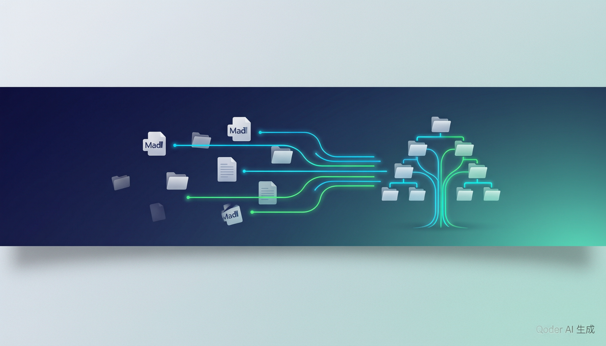
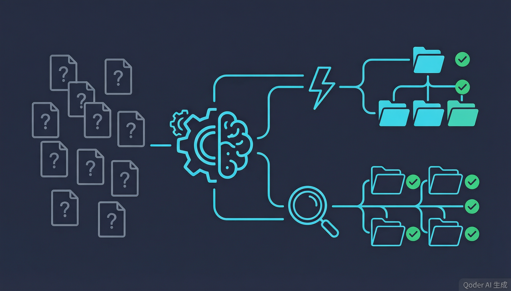
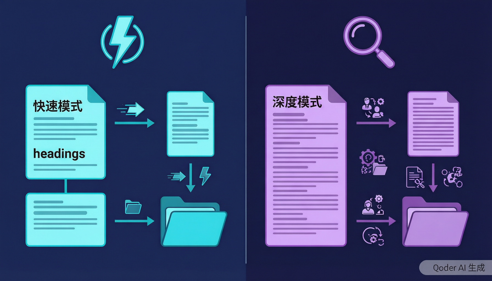

<p align="center">
  
</p>

<h1 align="center">kb-organizer</h1>

<p align="center">
  <strong>把一堆散乱的 Markdown 文档，分类整理成一棵可浏览的知识库文件树</strong>
  <br/>
  <em>AI Agent 驱动 · 增量更新 · 遵循 OKF v0.2 规范</em>
</p>

<p align="center">
  
  
  
  
</p>

---

## 它解决什么问题？

你有一批从 doc/xls/ppt 转换来的 Markdown 文件，散落在某个目录里。你需要把它们：

- **分类**到合适的目录层级
- **判断**是新建页面还是合并到已有页面
- **标注**内容矛盾，而不是悄悄覆盖
- **增量**处理——只处理新增和变更的文件

kb-organizer 是一个 **AI Agent Skill**，它定义了完整的分类整理流程，配合 `kb_tools.py` 脚本工具，让 LLM 只做决策、脚本做体力活。

<p align="center">
  
</p>

## 两种处理模式

<p align="center">
  
</p>

| | Light 模式 | Deep 模式 |
|---|---|---|
| **读取范围** | 只读标题 + headings + 首段 | 读全文 |
| **LLM 角色** | 只做路由决策 | 理解 + 改写 + 综合 |
| **新建页面** | `create-page` 脚本自动创建 | LLM 综合改写正文 |
| **合并页面** | `merge-append` 脚本追加 | LLM 打开全文综合改写 |
| **矛盾检测** | 跳过（换取速度） | 检测并标注 |
| **适用场景** | 大批量快速归档 | 少量文档精细整理 |

> Light 模式下，LLM 全程不读源文件正文——通过 `quick-classify` 提取元数据做分类决策，通过 `create-page` / `merge-append` 让脚本完成文件操作。

## 知识库目录结构

```
kb/
├── index.md                    # 根目录索引（自动生成）
├── log.md                      # 变更历史（人类可读）
├── _meta/
│   ├── manifest.json           # 源文件 → 落点登记表
│   ├── taxonomy.md             # 分类目录及说明
│   └── config.json             # 交互/处理策略
├── _inbox/                     # 分类不明确的内容暂存
├── 01-产品文档/
│   ├── index.md
│   ├── 产品A/功能概述.md
│   └── 产品B/接口文档.md
└── 02-运维手册/
    ├── index.md
    └── 支付网关运维手册.md
```

每个知识页面都带有 OKF 标准 front-matter：

```yaml
---
type: 产品文档
title: 产品A 功能概述
description: 产品A的核心功能与审批流程说明
tags: [产品A, 功能, 支付]
status: stable
generated: { by: kb-organizer/v10, at: 2026-08-27T10:00:00Z }
sources:
  - id: 产品A_功能规格书
    resource: raw/产品A_功能规格书.md
confidence: high
---
```

## 快速开始

### 1. 初始化知识库

```bash
python3 scripts/kb_tools.py init --kb-dir ./my-kb
```

### 2. 设置处理模式

```bash
python3 scripts/kb_tools.py set-config --kb-dir ./my-kb \
  --interaction-mode silent \
  --processing-mode light
```

### 3. 扫描变更

```bash
python3 scripts/kb_tools.py scan --source ./raw-docs --kb-dir ./my-kb
```

### 4. Light 模式处理流程

```bash
# Step 1: 提取元数据（不读全文）
python3 scripts/kb_tools.py quick-classify --source ./raw-docs/某文档.md

# Step 2a: 新建页面（脚本自动创建）
python3 scripts/kb_tools.py create-page --kb-dir ./my-kb \
  --source ./raw-docs/某文档.md \
  --target "01-产品文档/某文档.md" \
  --title "某文档标题" \
  --type "产品文档" \
  --description "一句话摘要" \
  --tags "标签1,标签2" \
  --category "01-产品文档" \
  --confidence high

# Step 2b: 或合并到已有页面
python3 scripts/kb_tools.py merge-append --kb-dir ./my-kb \
  --source ./raw-docs/某文档.md \
  --target "01-产品文档/已有页面.md" \
  --label "文档简称"

# Step 3: 登记 manifest
python3 scripts/kb_tools.py update-manifest --kb-dir ./my-kb \
  --source "某文档.md" \
  --hash "sha256:xxx" \
  --status new_file \
  --target "01-产品文档/某文档.md"
```

### 5. 生成索引

```bash
python3 scripts/kb_tools.py gen-index --kb-dir ./my-kb
```

## 命令速查

| 命令 | 用途 | 模式 |
|------|------|------|
| `init` | 初始化知识库目录骨架 | 通用 |
| `get-config` | 读取交互/处理策略偏好 | 通用 |
| `set-config` | 保存偏好配置 | 通用 |
| `scan` | 对比源目录与 manifest，输出变更列表 | 通用 |
| `quick-classify` | 提取标题/headings/首段，供 LLM 分类决策 | Light |
| `create-page` | 创建知识页面（复制正文 + OKF front-matter） | Light |
| `merge-append` | 追加源文件到已有页面，更新 sources | Light |
| `list-targets` | 列出分类目录下已有页面 + taxonomy 备注 | 通用 |
| `update-manifest` | 登记源文件处理结果 | 通用 |
| `retarget` | 挪动页面后同步 manifest | 通用 |
| `remove-entry` | 从 manifest 移除已删除的源文件记录 | 通用 |
| `gen-index` | 生成/刷新每层 index.md | 通用 |
| `log-entry` | 追加变更记录到 log.md | 通用 |

## 运行流程

```
Step 0  确认路径，读取偏好配置
  ↓
Step 1  scan 扫描变更（基于 SHA256 哈希对比）
  ↓
Step 2  分类目录（首次生成 taxonomy / 增量复用）
  ↓
Step 3  分类判断（light: quick-classify / deep: 读全文）
  ↓
Step 4  落位决策（新建 / 合并 / 子目录拆分 / inbox）
  ↓
Step 5  登记 manifest（每篇处理完立刻登记，支持中断恢复）
  ↓
Step 6  刷新 index.md + 写 log.md
  ↓
Step 7  运行报告
```

## OKF 规范对齐

本项目的输出格式严格遵循 [Google Open Knowledge Format v0.2](https://github.com/GoogleCloudPlatform/knowledge-catalog/blob/main/okf/SPEC.md)：

- **Front-matter**（§4.1）：`type`（必填）、`title`、`description`、`tags`、`status`、`generated`、`sources`
- **Sources**（§5.1）：每条必须有 `resource`，可选 `id`
- **Trust**（§5.2）：`generated: { by: <actor>, at: <ISO8601> }`，actor 约定 `agent/version`
- **Index**（§8）：`* [Title](url) - description`，根目录带 `okf_version: "0.2"`
- **Log**（§9）：按日期分组的叙事变更历史

## 项目结构

```
kb-organizer/
├── SKILL.md                              # Skill 流程定义（LLM 读这个）
├── scripts/
│   └── kb_tools.py                       # 确定性辅助工具（所有子命令实现）
├── references/
│   ├── frontmatter-and-taxonomy.md       # Front-matter 字段规范 + 分类参考
│   └── merge-and-conflict-conventions.md # 合并写法 + 冲突标注规范
├── images/                               # README 配图
├── CHANGELOG.md                          # 版本历史
└── README.md                             # 本文件
```

## 设计原则

1. **能用代码做的事不靠推理** — hash 对比、manifest 登记、front-matter 抽取交给脚本
2. **写入可追溯、可撤销** — 每页记录来源文件和 hash
3. **增量靠 hash，不靠记忆** — 基于 SHA256 对比，中途中断可恢复
4. **light 模式不读全文** — LLM 只做路由决策，脚本干体力活

## License

MIT
